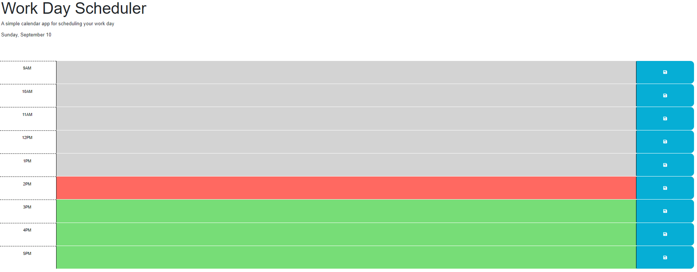

# mod5Challenge-WorkDayPlanner

# Description
## This is a planner for workday hours of 9am to 5pm.
## You are able to add events to a timeslot and they will persist even after a refresh.
## The timeslots are color coded and will change with the hour!
## Grey = The timeslot has already passed.
## Red = The current hour.
## Green = A hour that hasn't passed yet.

# Screenshot

# Deployed App

